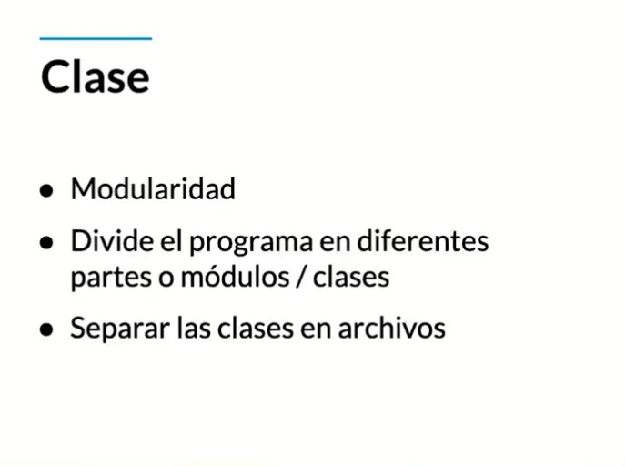

## INDICE
- [Poo](#poo)
- [Uml](#uml)
- [Objetos](#objetos)
- [Clases](#clases)
- [Abstracción](#abstracción)

## POO

    

    

## UML

    

    

    

## OBJETOS

    

    

    

## CLASES

    

## MODULARIDAD

    

    

## ABSTRACCIÓN

    

    

      ABSTRACIIÓN: Analizar un objeto para entender cuáles son sus propiedades(ATRIBUTOS) y 
      comportamientos(MÉTODOS),y así abstraer su composición y asi generar un molde genérico(CLASE)